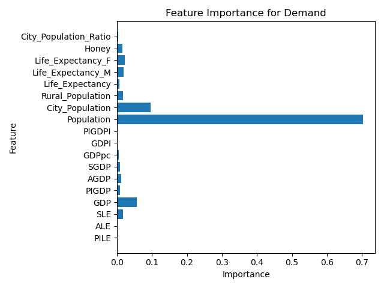

# 寻找潜在的蜂蜜市场
**学号：** 10225501464  
**作者：** 施长林  
**课程：** DaSE导论结课项目

## 项目介绍
安徽岳西盛产高品质的天然蜂蜜，然而当地农民确苦于没有销售渠道。为了帮助农民销售，在调研了中国蜂蜜市场情况后，欲使用数据科学的方法，探究哪个省份可能存在潜在的未发掘的蜂蜜市场。

## 数据获取
本项目中，主要采用了爬虫的方法获取数据，数据主要来自于国家数据网站的分省数据部分 [链接](https://data.stats.gov.cn/easyquery.htm?cn=E0103)，对其中一些可能相关的指标的各省份近十年数据进行了爬取。

### 请求网页
国家数据网站基于XHR，使用开发者模式研究Fetch/XHR，例如点击指标-人口-总人口，有如下信息：

再点击最近十年，有如下变化：

即dfwds有两组，分别是指标代码和时间范围，而省份的选择则会影响wds中的valuecode，k1是时间戳。通过requests库发送这些信息进行爬虫。

### 内容解析
解析上一步中保存至本地的网页JSON文件，

可以看到实际的数据位于strdata中。此处注意到，网站目前更新了2023的条目，但没有数据，所以爬取出来的都有一个空的2023项目，为了获得2022-2013十年中的数据，我们需要请求LAST11，然后去除掉2023的条目。根据此JSON的格式，可以用["returndata"]["datanodes"][i]["data"]["strdata"]来提取strdata，i是节点的序号，类似于二维数组在内存中的排布，由列数（年份）和行数（指标）确定一个数据所在节点的序号。

### 数据存储
采取的策略是将每一个指标保存为一个csv文件，它的每一列代表一个年份，从2022年到2013年；而每一行则代表一个省份，按省份代码排序。另外，从按年份和按时间两个角度，将数据合并。

### 数据处理
在进一步分析前需要处理爬取得到的数据中的空缺，此处采用线性插值的方法来填充缺失的数据；还需要对一个指标一年内的数据进行归一化。

### 补充数据
利用直接爬取得到的数据，可以计算衍生指标。例如，由城市人口和总人口数，可以计算出城市人口率作为一项新的指标。除了从国家数据网站上爬取的这些指标的数据，另从行业报告中收集了个省份蜂蜜表观需求量的数据，以同样的格式用csv文件存储。

## 基本统计信息与可视化
对于采集到的各项指标，各城市的十年变化，我们分析一些基本的统计指标，例如均值，总数，标准差和极差，进行可视化展示，例如蜂蜜产量：

各种指标的图标位于./plot/index_change

## 特征工程
### 相关性分析
各指标的相关系数如下：

随机森林模型得出的特征重用性如下：

综合两者考虑，可以选择下列特征用于建模
- "Life_Expectancy_M"
- "SLE"
- "Population"
- "GDP"
- "Honey"

### PCA降维
除了直接选取可能相关的特征，还可以用PCA对数据进行降维，如下图所示：

尝试将数据由PCA降至两维：

## 数据建模
尝试使用线性回归模型进行建模，用2013-2021的数据训练模型，评估模型效果。例如，用4.1中分析出的5个可能比较重要的特征建模：

通过MSE和R2可知，模型效果尚可，用模型对2022年的数据进行预测，再与2022年的实际值比较，以预测值减去实际值为差异，如果较大，说明该省份可能有潜在的蜂蜜市场，如下图所示：

还可以用4.2中获得的PCA降维后的数据进行回归分析，类似可得：

## 总结
### 初步结论
根据以上两种方法处理后的数据的回归结果可知，有几个省份有比较明显的实际值小于预测值，包括江苏省，安徽省，山东省，河南省。这些省份作为经济，人口大省，目前可能仍有一定的蜂蜜市场余量没有被发掘，可以加入蜂蜜销售地点的备选范围中。

### 反思与展望
本项目中还有诸多不足之处，主要包括采集的指标项目不够多，以及建模比较简单，效果可能不够理想等。未来将在这两个方面继续深化，用更多的数据，更精密的模型进行更精准的预测。
